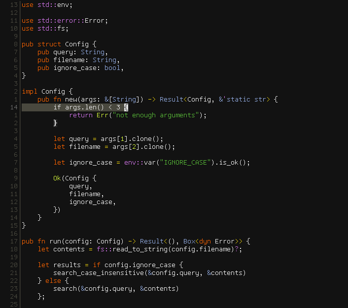

# spacecamp.kak
> A port of the [SpaceCamp](https://github.com/jaredgorski/SpaceCamp) color scheme for Kakoune.


## Installation
**With [plug.kak](https://github.com/andreyorst/plug.kak):**
```kak
plug "haukkagu/spacecamp" theme
```
**Without a plugin manager:**
```sh
git clone https://github.com/haukkagu/spacecamp.kak
mkdir -p ~/.config/kak/colors
cp spacecamp.kak/colors/* ~/.config/kak/colors
```

## Usage
The plugin provides two color schemes: `spacecamp` and `spacecamp-lite`. The latter has a slightly lighter background than the former.

To enable one of the color schemes, add one of the following lines to `~/.config/kak/kakrc`:
```kak
colorscheme spacecamp
```
or...
```kak
colorscheme spacecamp-lite
```

## Credits
Thanks to [Jared Gorski](https://github.com/jaredgorski) for creating this amazing color scheme!
